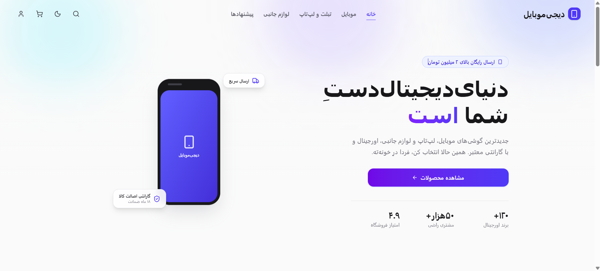
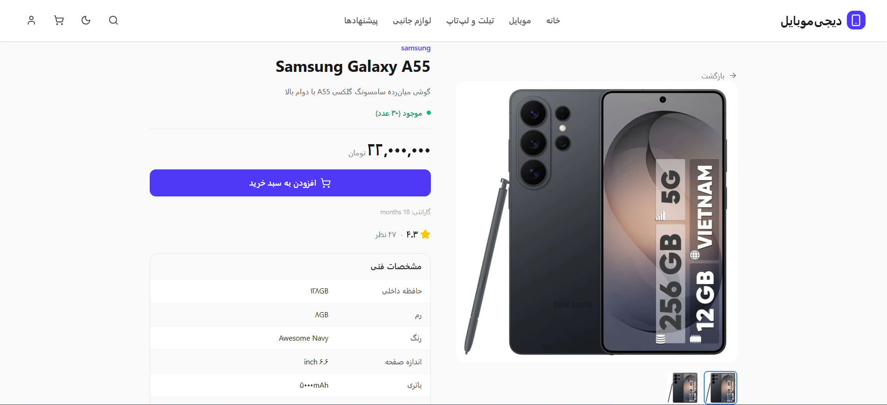
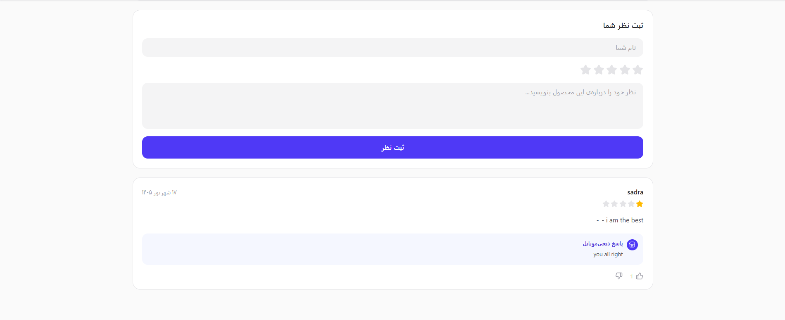
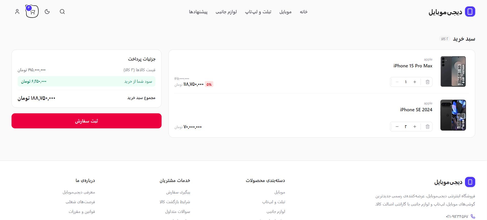

# 📱 DigiMobile

A full-featured, RTL Persian e-commerce storefront for mobile phones — built as a hands-on React learning project.



**Companion project:** [mobile-shop-admin](https://github.com/sadra-devx/mobile-shop-admin) — shares the same `json-server` backend for order fulfillment & comment moderation.

---

## ✨ Features

- 🏠 **Home** — hero, categories, featured products, promo banners
- 🔍 **Product listing** — filters, sorting, infinite scroll
- 📦 **Product detail** — gallery, specs, ratings, installment pricing
- 🛒 **Basket** — persistent cart, on-card quantity stepper, live pricing
- 💳 **Real checkout** — order creation tied to logged-in or guest users
- 🔐 **Auth** — login/signup, protected routes, persistent sessions
- 👤 **Profile** — editable info + full order history
- 💬 **Comments** — star ratings, admin moderation, likes/dislikes, admin replies
- 🌓 **Dark mode** + full RTL layout (Estedad font)

| Product Detail | Comments | Basket |
|---|---|---|
|  |  |  |

---

## 🛠️ Tech Stack

React 19 · Vite · React Router v7 (loaders) · Tailwind CSS v4 · axios · Sonner · Framer Motion · json-server `0.17.4`

---

## 🏗️ Architecture Highlights

- Data fetching via **React Router loaders** (not `useEffect`), composed with `Promise.all` for multi-source pages
- Auth & basket state persisted to `localStorage`, synced through React Context
- Basket stores only `{ id, quantity }` — product data is always fetched fresh
- Comments follow a **moderation pipeline**: `pending` → admin review → `approved`

---

## 🚀 Getting Started

```bash
git clone https://github.com/sadra-devx/mobile-shop.git
cd mobile-shop
npm install
cp .env.example .env

# in a separate terminal, from wherever db.json lives:
npx json-server@0.17.4 --watch db.json --port 3001

npm run dev
```

> ⚠️ `json-server` must stay pinned to `0.17.4` — later beta versions break the query filters this project relies on.

---

## 📄 License

Personal learning project — not licensed for commercial use.